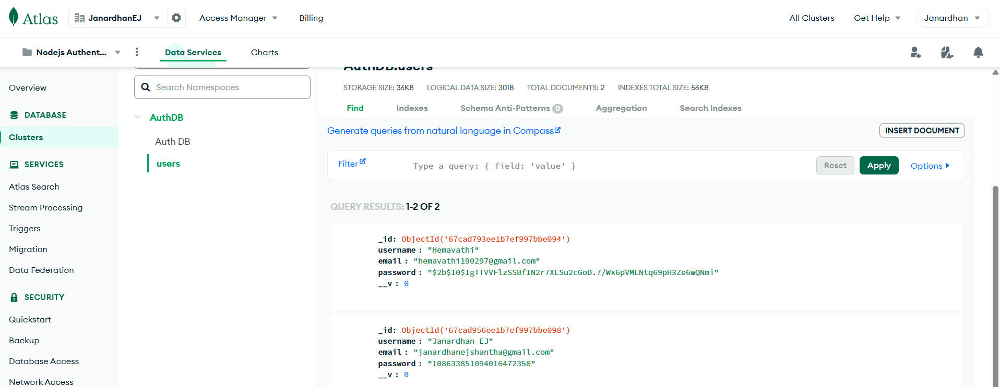
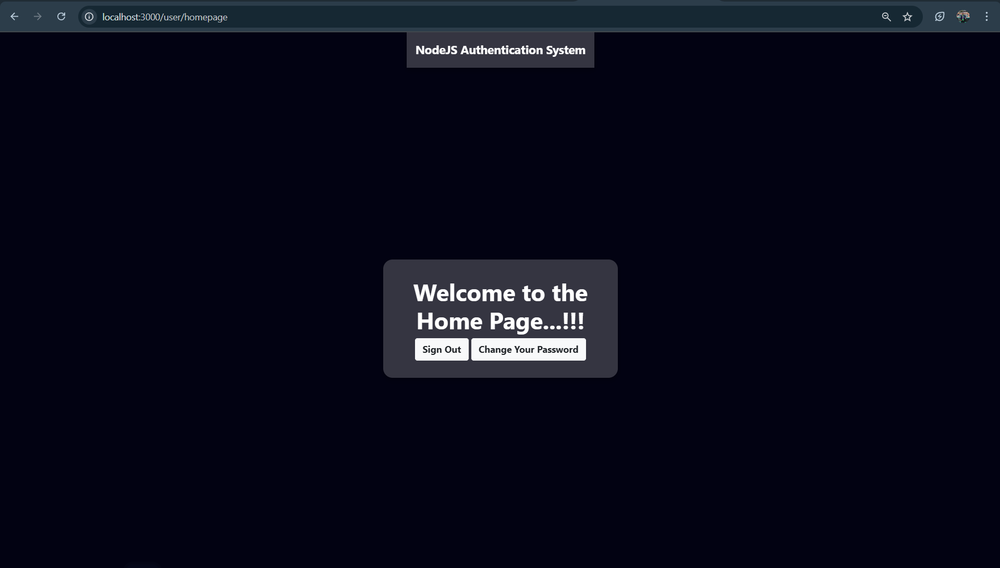
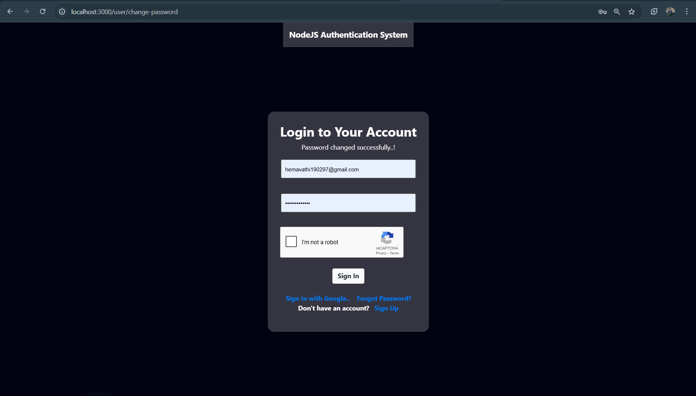

# Node.js Authentication System

This project is a Complete Authentication System using Node.js, Express and MongoDB. It supports User Registration,
User Login/Logout, Password Reset and Google Authentication for Signing in and Signing up.


## Live Demo
Link:


## Features Implemented

- **Sign-up with Email**: Create an account using your email and password.
- **Sign-in**: Securely log into your account using your email and password.
- **Sign Out**: Log out of your session.
- **Reset Password**:  Reset your password securely after signing in.
- **Encrypted Passwords**: Passwords are securely stored in MongoDB using encryption for enhanced security.
- **Google Login/Signup**: Easily sign in or sign up using your Google account.
- **Forgot Password**:  Reset your password via email. (A temporary password is generated and sent via email)
- **Password Strength Validation**: Display notifications for mismatched passwords during sign-up and incorrect passwords during sign-in.
- **reCAPTCHA Integration**: Added reCAPTCHA to protect sign-up and login pages from bot attacks.


## Environment Variables

Before running the application locally, create a .env file at the root of your project and configure the following environment variables:

1. **PORT**: Port number the application will listen on.
2. **DB_URL**: MongoDB database connection URL String.
3. **CLIENT_ID**: Google OAuth client ID for social authentication.
4. **CLIENT_SECRET**: Google OAuth client secret for social authentication.
5. **EMAIL**: Email address used for sending notifications and password reset emails.
6. **PASSWORD**: App-specific password or standard Gmail password for the email account.
7. **RECAPTCHA_SECRET_KEY**: Google reCAPTCHA secret key for verifying human interaction.
8. **CLIENT_URL**: Redirect URL after a successful Google sign-in (e.g., http://localhost:3000/auth/login/success).

Ensure all values are correctly set before starting the application.

**Example `.env` file:**
```plaintext
PORT=3000
DB_URL=mongodb://localhost:27017/authdatabase  
CLIENT_ID=your_client_id 
CLIENT_SECRET=your_client_secret
EMAIL=your_email@gmail.com
PASSWORD=your_password
RECAPTCHA_SECRET_KEY=your_recaptcha_secret_key
CLIENT_URL=http://localhost:3000/auth/login/success
```


## Dependencies/technologies 

The project leverages the following Node.js dependencies and technologies:
- Express.js
- MongoDB
- Passport.js
- bcrypt
- express-session
- express-ejs-layouts
- dotenv
- nodemailer


## How to Use:

Follow these steps to run the project locally:
1. Clone the repository: git clone https://github.com/JanardhanEJ/janardhanej1906-NodeJS-Authentication.git
2. Navigate into the project directory: 
   cd janardhanej1906-NodeJS-Authentication
3. Install dependencies:
   npm install
4. Start the server:
   npm start
5. Open your web browser and visit http://localhost:3000 to access the application.


## Screenshots: (taken locally)
1. Open your web browser and go to http://localhost:3000/user/signin
You will see a login page like this:


## 2. Sign Up
a) If you don’t have an account, click on the Sign Up link.
Fill in all the required details, complete the reCAPTCHA verification and click on the Sign Up button.
eg: 

b) Few common errors while Signing Up:


c) After a successful sign-up, you will see a notification like this:


d) Sample database entry:


## 3. Sign In
Use the same email and password used during registration.
Complete the reCAPTCHA verification and click on the Sign In button.
Example: 

a) If the entered details match, you will be redirected to the homepage:


b) If the entered details do not match, an Invalid credentials error notification will be displayed:


## 4. Change Password
a) After a successful login, you can change your password by clicking on the Change Password button.
Fill in the required details and complete the reCAPTCHA verification.
Example: 

b) After a successful password change, you will see a notification like this:


c) If you enter your old password incorrectly, an Invalid credentials error notification will appear like this:


## 5. Sign Out
After a successful login, you can sign out by clicking on the Sign Out button.
After signing out, you will see a notification like this:


## 6. Sign In with Google
a) To sign in with Google, click on the Sign in with Google link. It will redirect you to the Google sign-in page:


b) After a successful Google sign-in, you will be redirected to the homepage:


## 7. Forgot/Reset Password
a) If you forget your password, click on the Forgot Password link.
Fill in the required details, complete the reCAPTCHA verification and click on the Forgot Password button.
Example: 

b) After a successful password reset, you will see a notification like this:


c)Then check your registered email. A temporary new password will be sent from the admin's email address to your registered email address:
Example: 

Use the temporary new password (sent via email) to sign in and then change your password.

d) If you enter an unregistered email ID, a User does not exist notification will appear like this:

